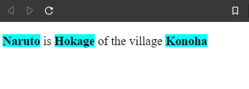

# Tagged Template Literals in ES6

With a plethora of features that were ushered into the language in the ECMAScript 2015 (ES6), one of the most pragmatic feature that I find very commonly used is the template strings. Template literals are string literals allowing embedded expressions.

This allowed us to get rid of this somewhat clumsy syntax while creating a string using concatenation ,

```js
const character = {
  name: 'Din Djarin',
  creed: 'Mandalorian',
  dialogue: 'I can bring you in warm, or I can bring you in cold',
};

const sentence = character.name + ' is a ' + character.creed + ', and says "' + character.dialogue + '".';
console.log(sentence);
```

```txt
> Din Djarin is a Mandalorian, and says "I can bring you in warm, or I can bring you in cold".
```

With ES6 template literals we could create a string using a much cleaner syntax and it is something we have been using day in and day out.

```js
const sentence = `${character.name} is a ${character.creed}, and says "${character.dialogue}".`;
console.log(sentence);
```

```txt
> Din Djarin is a Mandalorian, and says "I can bring you in warm, or I can bring you in cold".
```

A very powerful feature of template literals is that we can _tag_ them, that means we can run the template string through a function rather than have them value immediately assigned. This description of _tagged template literals_ may seem a bit obscure, let us try to understand this concept through examples.

The way the tag template works is you make a function that is going to process the string, and you take the name of the function that you want to run against the string, and you place the function name right in front of the template string.

```js
const strongify = () => {
  // do something
};

const characterOne = {
  name: 'Naruto',
  rank: 'Hokage',
  village: 'Konoha',
};

const characterOneDescription = strongify`${characterOne.name} is ${characterOne.rank} of the village ${characterOne.village}`;

console.log(characterOneDescription);
```

```txt
> undefined
```

The output is `undefined` instead of the complete string because the template string is processed by `strongify` function and it does not return anything, that is the reason the variable `characterOneDescription` is set to the value of `undefined`.

Let's make the `strongify` function return something.

```js
const strongify = () => {
  return 'Damn the tagged template literals are sick!';
};

const characterOne = {
  name: 'Naruto',
  rank: 'Hokage',
  village: 'Konoha',
};

const characterOneDescription = strongify`${characterOne.name} is ${characterOne.rank} of the village ${characterOne.village}`;

console.log(characterOneDescription);
```

```txt
> Damn the tagged template literals are sick!
```

The function which with which we tag the string is called with the following arguments:

1. An array comprising of all the string parts.
2. Individual values as separate arguments.

Let's see this in code,

```js
const strongify = (strings, value1, value2, value3) => {
  console.log(`Inside strongify: ${strings}`);
  console.log(`Inside strongify: ${value1}`);
  console.log(`Inside strongify: ${value2}`);
  console.log(`Inside strongify: ${value3}`);
  return 'Character description: cool';
};

const characterOne = {
  name: 'Naruto',
  rank: 'Hokage',
  village: 'Konoha',
};

const characterOneDescription = strongify`${characterOne.name} is ${characterOne.rank} of the village ${characterOne.village}`;

console.log(characterOneDescription);
```

```txt
> Inside strongify: , is , of the village ,
  Inside strongify: Naruto
  Inside strongify: Hokage
  Inside strongify: Konoha
  Character description: cool
```

Capturing the values as `value1`, `value2` ... is not a very efficient way, therefore going forward we will use the ES6 rest operator to pack all the values into an array, so our code will look like this now,

```js
const strongify = (strings, ...values) => {
  console.log(`Inside strongify: ${strings}`);
  console.log(`Inside strongify: ${values}`);
  return 'Character description: cool';
};

const characterOne = {
  name: 'Naruto',
  rank: 'Hokage',
  village: 'Konoha',
};

const characterOneDescription = strongify`${characterOne.name} is ${characterOne.rank} of the village ${characterOne.village}`;

console.log(characterOneDescription);
```

```txt
> Inside strongify: , is , of the village ,
  Inside strongify: Naruto,Hokage,Konoha
  Character description: cool
```

So we have received the following strings and values,

| Strings          | Values   |
| ---------------- | -------- |
| ''               | 'Naruto' |
| ' is '           | 'Hokage' |
| 'of the village' | 'Konoha' |
| ''               |          |

> NOTE: **There will be always one more string than value**, while the function processes the template literal it will always start with a string and end with a string. Our template literal `characterOne` may seem to start and end with a value, in this case the parsing function treat the starting string and ending string as an empty string.

Let's try if we could process the entire string and render as it should without the tag, using a tagged function :wink:

So we append the first item from string array with the first item from value array, and so on

```js
const strongify = (strings, ...values) => {
  let str = '';
  strings.forEach((string, index) => (str += string + values[index]));
  return str;
};

const characterOne = {
  name: 'Naruto',
  rank: 'Hokage',
  village: 'Konoha',
};

const characterOneDescription = strongify`${characterOne.name} is ${characterOne.rank} of the village ${characterOne.village}`;

console.log(characterOneDescription);
```

```txt
> Naruto is Hokage of the village Konohaundefined
```

OOPS! we have four strings and three values (remember we will have one string more than the number of values), therefore we get this incorrect result. Let's fix this by using the _OR operator default value pattern_.

```js
const strongify = (strings, ...values) => {
  let str = '';
  strings.forEach((string, index) => (str += string + (values[index] || '')));
  return str;
};

const characterOne = {
  name: 'Naruto',
  rank: 'Hokage',
  village: 'Konoha',
};

const characterOneDescription = strongify`${characterOne.name} is ${characterOne.rank} of the village ${characterOne.village}`;

console.log(characterOneDescription);
```

```txt
Naruto is Hokage of the village Konoha
```

This looks good, now we know how to tag strings with functions, but we haven't done anything different until now.

Suppose the `characterOneDescription` is to be displayed on an HTML document and the values supplied to the template literal must indicate strong importance i.e. while displaying the template string the values must be wrapped in `<strong>` tag.
Let's tweak our code

`index.html`

```html
<!DOCTYPE html>
<html lang="en">
  <head></head>
  <body>
    <p id="character-description"></p>
    <script src="./app.js"></script>
  </body>
</html>
```

`app.js`

```js
const strongify = (strings, ...values) => {
  let str = '';
  strings.forEach(
    (string, index) =>
      (str += `${string} <strong>${values[index] || ''}</strong>`)
  );
  return str;
};

const characterOne = {
  name: 'Naruto',
  rank: 'Hokage',
  village: 'Konoha',
};

const characterOneDescription = strongify`${characterOne.name} is ${characterOne.rank} of the village ${characterOne.village}`;

const description = document.getElementById('character-description');
description.innerHTML = characterOneDescription;

```

The output is,



This was a very simple use case we tries out with the tagged template strings.There are much more complicated use cases for that.The main idea is this if you have a template literal and want to process it programatically before it is assigned to a variable we can do that by tagging the template string with a function.

One very common use case is representing Windows file paths in our JavaScript files.

```js
const filePath = `D:\Games\steamapps\common\Grand Theft Auto V`;
console.log(filePath);
```

```txt
> D:GamessteamappscommonGrand Theft Auto V
```

This is because the backslash indicates an `escape character` in JavaScript, to fix that we have to `escape` the back slash

```js
const filePath = `D:\\Games\\steamapps\\common\\Grand Theft Auto V`;
console.log(filePath);
```

```txt
> D:\Games\steamapps\common\Grand Theft Auto V
```

To avoid having to `escape` backslashes we can use the built-in `String.raw()` static tag function for the template literals,

```js
const filePath = String.raw`D:\Games\steamapps\common\Grand Theft Auto V`;
console.log(filePath);
```

```txt
D:\Games\steamapps\common\Grand Theft Auto V
```

## Conclusion

So in this post we looked at how we can create tag functions to process template literals, and demonstrated how convenient it becomes to process strings using one of the built-in tag method.

Happy coding :sunglasses:


